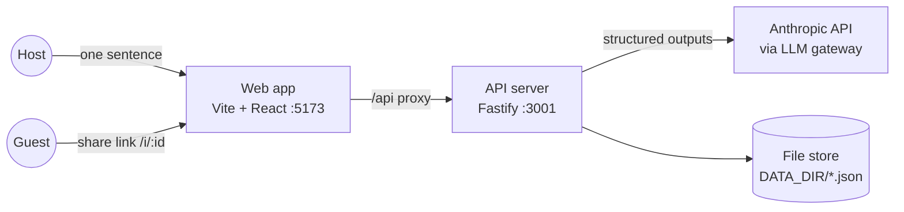
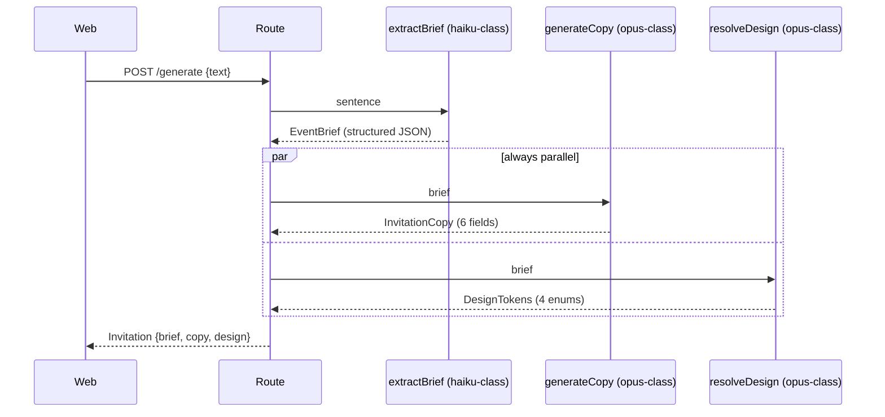

# 04 — Architecture

Structure loosely follows arc42: context → containers → runtime → data →
cross-cutting. Decisions with alternatives live in [decisions/](decisions/).

## 1. System context



Two user roles, no third-party integrations besides the LLM provider. The web
dev server proxies `/api` to the API server; in production the same origin is
assumed.

## 2. Containers

**`web/` — Vite + React SPA.** Four routes in
[AppRoutes.tsx](../web/src/AppRoutes.tsx) on react-router-dom, declarative mode
only ([adr-011](decisions/adr-011-client-router.md)): `/` landing, `/create`
editor ([App.tsx](../web/src/App.tsx)), `/i/:id` guest page
([GuestPage.tsx](../web/src/GuestPage.tsx)), `/manage/:id` host dashboard
([ManagePage.tsx](../web/src/ManagePage.tsx)).
[main.tsx](../web/src/main.tsx) is the `BrowserRouter` entry point only.
Route params are permissive, so [invitationId.ts](../web/src/invitationId.ts)
carries the id shape the old route regexes enforced, checked in the hooks that
call the API. All server communication goes through
[api.ts](../web/src/api.ts). [types.ts](../web/src/types.ts) hand-mirrors the
server schemas.

**`server/` — Fastify API.** Layers:

| Layer | Files | Responsibility |
| --- | --- | --- |
| Routes | `routes/invitations.ts` | Validation (zod), status codes, metrics hooks |
| Pipeline | `pipeline/{brief,copy,design,generate}.ts` | Prompts + orchestration per stage |
| LLM gateway | `llm/{gateway,routing,pricing}.ts` | Model routing, fallbacks, structured outputs, cost/latency logging |
| Store | `store.ts` | Published records: versions, RSVPs, manage tokens |
| Metrics | `metrics.ts` | In-process product counters |
| Schemas | `schemas.ts` | Source of truth for every shape crossing a boundary |

## 3. Runtime view — generation pipeline



Copy and design depend **only** on the brief — that independence is what makes
the parallel step legal and is the key to the ~3s latency target (NFR-1).
Field regeneration is a single completion over (brief, field, current value).

## 4. LLM gateway

- [routing.ts](../server/src/llm/routing.ts) — the **single operator switch
  point**: task → primary model → fallbacks + per-task `maxTokens`. Four tasks:
  `brief_extraction`, `copy_generation`, `design_resolution`,
  `field_regeneration`.
- [gateway.ts](../server/src/llm/gateway.ts) `completeJson()` walks the chain
  until a model succeeds; responses are schema-enforced via Anthropic
  structured outputs (`messages.parse` + `zodOutputFormat`); one JSON log line
  per request (task, model, fallback, latency, tokens, cost).
- [pricing.ts](../server/src/llm/pricing.ts) — per-model token prices;
  `test/routing.test.ts` fails if a routed model lacks an entry.
- Multi-provider/BYOK is in-process
  ([adr-007](decisions/adr-007-in-process-providers.md)):
  [openaiCompat.ts](../server/src/llm/openaiCompat.ts) calls
  Gemini/OpenAI/Groq/Ollama through their OpenAI-compatible endpoints; the
  routing-table interface remains the stability contract
  ([adr-002](decisions/adr-002-llm-gateway.md)).

## 5. Rendering model

**No image generation.** The model only selects design tokens — closed enums
(`palette` × `typography` × `layout` × `ornament`). 
[InvitationPreview.tsx](../web/src/components/InvitationPreview.tsx) maps each
token 1:1 to CSS classes in [styles.css](../web/src/styles.css); the same
component renders the editor preview and the guest page, so published output
is pixel-identical to what the host saw. Model output is never interpreted as
markup or styles ([adr-003](decisions/adr-003-no-image-generation.md)).

## 6. Data model & persistence

Draft invitations live only in client state. Publishing creates a
`PublishedRecord` ([store.ts](../server/src/store.ts)):

```
PublishedRecord
├── id            8 random bytes, base64url (the share slug)
├── manage_token  16 random bytes hex — the host capability
├── versions[]    append-only Invitation snapshots; guests see the last
├── rsvps[]       append-only {name, attending, guests_count, note, created_at}
└── created_at / updated_at
```

One JSON file per record under `DATA_DIR` (default `./data`), written
atomically (write-then-rename). The store's function interface is the seam for
a future DB swap (NFR-7).

## 7. Cross-cutting

- **Auth:** capability tokens only — the share `id` grants read+RSVP, the
  `manage_token` grants republish+RSVP-list. No sessions, no users.
- **Validation:** every boundary shape parses through
  [schemas.ts](../server/src/schemas.ts); route handlers return `400` on parse
  failure, `403` on token mismatch, `502` when all models fail.
- **Language:** `EventBrief.language` drives copy; UI language is independent
  ([i18n.ts](../web/src/i18n.ts)).
- **Observability:** gateway log lines + `/api/metrics` counters (NFR-6).

## 8. Deployment (current)

Dev: `pnpm dev` runs both watchers (API :3001, web :5173 with `/api` proxy).
Prod story is not yet defined; the single-process assumption (file store,
in-memory metrics) is the main constraint to resolve before hosting
(NFR-7).
